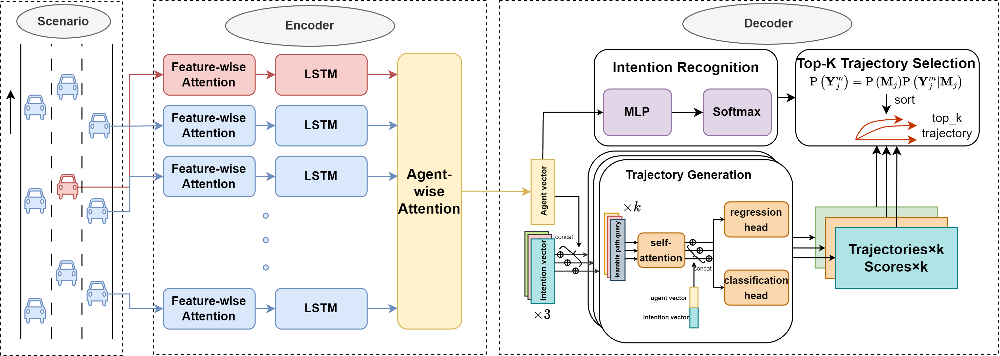

## README

This code come from the paper **" Multimodal Trajectory Prediction with Intention Recognition and Learnable Path Queries"**


### Environment

You can create a virtual environment by `env.yaml`.

```shell
conda env create -f env.yaml --name your_env
conda activate your_env
```

---

### Dataset 

Due to hardware resource limitations, this paper did not use all the data from the **highD dataset** for training, but instead randomly selected a portion from it.  The steps to obtain  the dataset are as follows:

1. set the address in `dataset.highD.utils`

```python
RAW_DATA_DIR = r""   ## raw data
PROCESSED_DATA_DIR = r"" ## processed_data
DATASET_DIR = r""  ## the parent directory of PROCESSED_DATA_DIR
```

2. run `generate_training_data.py` to get processed data

```shell
python generate_training_data.py --predict_length xxx   #You can specify the length of the prediction time domain, in seconds (s).
```

---

### Training 

1. set the save path in `train.py`, The training_model, checkpoint and and the training loss list will be saved in it.

```python
#save path
save_path = f''
if not os.path.exists(save_path):
    os.makedirs(save_path)
```


2. run `train.py` to train a prediction model

```shel
python train.py --predict_length xx
```

---

### Test

1. load model from the save path

```
model.load_state_dict(torch.load(f"save\\path"))
```

2. run test.py

```
python test.py --predict_length xx
```

---

### Optimization

We use `hyperopt` to optimize the hyperparameters of the model.

1. set the optimization space in `hyper_opt.py`

```
space = {
        "hidden_size": hp.choice("hidden_size", [32,64,128,256]),
        "style_size": hp.choice("style_size", [8, 16, 32, 64, 128]),
        "decoder_size": hp.choice("decoder_size", [64, 128, 256]),
        "num_layers": hp.choice("num_layers", [1,2,4]),
        "head_num": hp.choice("head_num", [1,2,4]),
        "inputembedding_size": hp.choice("inputembedding_size", [8, 16, 32, 64, 128]), 
        "lr": hp.choice("lr", [0.001]),
        "epoch": hp.choice("epoch", [200]),
        "decay_rate": hp.choice("decay_rate", [0.1, 0.5, 1.0]),
        "decay_step": hp.choice("decay_step", [50, 100]),
        "batch_size": hp.choice("batch_size", [32, 64, 128, 256]),
        "patience": hp.choice("patience", [30]),
    }
```

2. set the save path

```
save_path = f'./save/path/'
if not os.path.exists(save_path):
    os.makedirs(save_path)
```

3. run `hyper_opt.py`

```
python hyper_opt.py --predict_length xx
```

